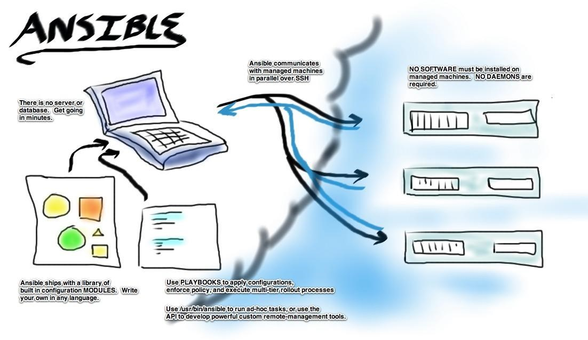
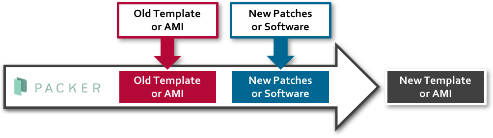

# Infrastructure-as-code (IAC)

Infrastructure as Code seems like a silly name because we all know that our infrastructure is made up of pieces of electronic equipment with pretty flashing lights. But in today’s world, we define our workloads that run on this equipment as lines of code.

## [Ansible](./ansible/README.md)

Ansible is an open source IT configuration management and automation tool. Similar to Puppet and Chef, Ansible has made a name for itself among system administrators that need to manage, automate, and orchestrate various types of server environments. Unlike Puppet and Chef, Ansible is agentless, and does not require a software agent to be installed on the target node (server or switch) in order to automate the device. By default, Ansible requires SSH and Python support on the target node, but Ansible can also be easily extended to use any API.

## [Packer](./packer/README.md)

An open source product from HashiCorp called “Packer” is a tool for managing your machine templates as defined by a JSON file. At first glance you might think, “Why would I need to manage my templates as a JSON file? They don’t change much so who cares?” But in reality, these templates are getting trickier to keep track of than they used to be. Organizations are now venturing more and more into public cloud spaces as well as keeping their on-premises vSphere environments, and they’ll need templates in each location which could result in template sprawl and version inconsistencies.

## [Terraform](./terraform/README.md)