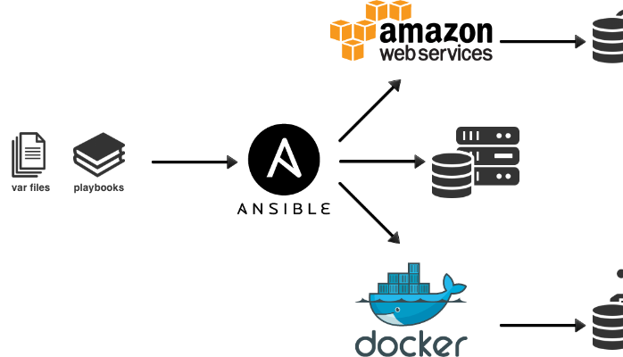

# What is Ansible

Ansible is an open source IT configuration management and automation tool. Similar to Puppet and Chef, Ansible has made a name for itself among system administrators that need to manage, automate, and orchestrate various types of server environments. Unlike Puppet and Chef, Ansible is agentless, and does not require a software agent to be installed on the target node (server or switch) in order to automate the device. By default, Ansible requires SSH and Python support on the target node, but Ansible can also be easily extended to use any API. 
For more on Ansible, please reference Ansible's official docs.

# How do I install it?

If you are a Python developer and have virtualenv installed, it's as simple as creating a virtualenv and then running pip install ansible inside it. Otherwise, refer to the official documentation.




# How do I run it?

Ansible works over SSH, and does not require any special software installed on the remote server. Principally, you only need a Linux instance which you can acces over SSH. The prefered method of authentication is using private keys instead of passwords, due to security and ease of use. The collection of servers on which an Ansible playbook should run is specified in what is called the inventory. The inventory lists the names of the computers together with connection information such as SSH port and IP address. If you already have a server to which you can SSH as root on the default port, here is what you should put into a file named inventory:

```server ansible_ssh_host=IP_ADRESS```

A sample inventory file is included in the example directory within this repo, within which we will be running the sample playbooks. You can go ahead and change it to suit your setup. Since we will be modifying the system quite a bit, you are recommended to use a server you can wipe and reinstall at will. The easiest way to do this is to use a VM, either locally or from a provider. Depending on which option you choose, the inventory file is going to be a bit different.

# VM

The easiest way to create and manage VMs locally is using Vagrant. Install it and start a VM loaded with Ubuntu 14 by running the command vagrant init sincerely/trusty64. SSH into it with vagrant ssh, do an ls to make sure everything is working. All right, that was the easy part. Vagrant initializes the virtual machine with a default unsafe SSH key. In order to access this VM as root, you have to copy your own SSH key into this VM, and add it to the authorized keys of the root account. Assuming that the key you want to copy is in /Path/to/your/id_rsa.pub, run the following command:

```scp -P 2222  /Path/to/your/id_rsa.pub vagrant@127.0.0.1:/tmp```

If you are prompted for a password, enter vagrant, the default password for the default Vagrant box. Now SSH into the machine again with vagrant ssh from within the directory where it was created, and run the following commands in order to add your key to the root account's authorized keys:

```
sudo su
mkdir -p -m 700 /root/.ssh
cat /tmp/id_rsa.pub >> /root/.ssh/authorized_keys
chmod 600 /root/.ssh/authorized_keys
```

Now you should be able to SSH from anywhere on the host computer into the VM as root with ssh -p 2222 root@127.0.0.1. The default Vagrant box comes with the user vagrant that has sudo rights, and one could run most of the commands we will use for demo purposes with that user. The aim of adding the root user is to make the examples uniform.

Last but not least here is what the contents of the inventory file should be:

``server ansible_ssh_port=2222 ansible_ssh_host=127.0.0.1```

# Ping it

Once you have your test server set up, run the following command to check whether Ansible can contact the server:

``` ansible -i inventory server -m ping ```

As a response, you should see the following, anything else means something went wrong:

```
server | success >> {
    "changed": false,
    "ping": "pong"
}
```


You're right, the above command is too much stuff for a simple ping. The stand-alone ansible command is rarely used, though; it is mostly for the purpose of testing individual modules, or running emergency commands on a set of servers. The above ping command does the following: Use the inventory passed with the -i argument to run the module passed with the -m argument. The concept of modules will be explained in the next section. The ping module does not need any arguments, but if it did, it would have been possible to pass them with another switch. But as mentioned, we are interested in more complicated stuff and not a crappy replacement for ssh -c, so read on for plays, roles, and more.

# Plays, Modules, etc

There are only four fundamental concepts necessary for grokking Ansible; if you understand these, you're halfway there. To make it as simple as possible, here is a plain list:

* **Modules** are units of action. For pretty much everything you would do on a server, there is a module. They can be built-in or add-ons. Examples are ping, copy/modify/delete file, install packages, start/stop/restart a service etc.

* **Inventory** is the specification of a set of servers and how to connect to them. Ansible provides very convenient ways to specify sets of servers, and aliases for these.

* **Roles** are collections of actions that serve a purpose, and data that belongs to these actions. Examples are installing, configuring and then starting a database server, or retrieving code, building it, moving it to servers and runing it.

* **Playbooks** are collections of roles to run on a cluster of servers, completed with more data.

So in effect, **roles are collections of module applications, and playbooks are specifications of which roles should be matched to which inventory.** Module application means that a module is ran on a host with some arguments.


