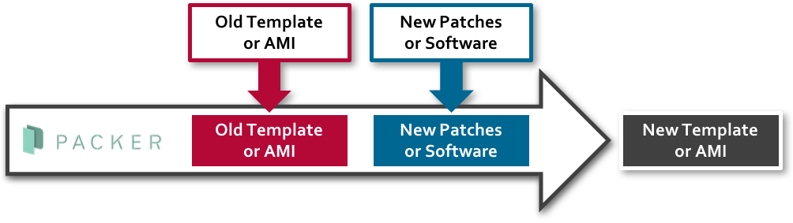
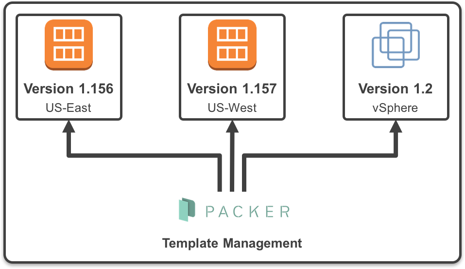

# About Packer
An open source product from HashiCorp called “Packer” is a tool for managing your machine templates as defined by a JSON file. At first glance you might think, “Why would I need to manage my templates as a JSON file? They don’t change much so who cares?” But in reality, these templates are getting trickier to keep track of than they used to be. Organizations are now venturing more and more into public cloud spaces as well as keeping their on-premises vSphere environments, and they’ll need templates in each location which could result in template sprawl and version inconsistencies.

# Using Packer

Leveraging Packer allows you to build a new template based on an existing image, which could be a great way to patch templates with new updates, add additional functionality in your base images, keep templates identical in multiple clouds, and best of all, store your image as a piece of code in your version control repository.

The basic process for using Packer includes taking an old template or Amazon machine image, applying new patches or software to it, and creating a new template or AMI from the results of those two actions. The original template is unharmed and a newly versioned template is created.

The result of using Packer across multiple environments means that through a single process, you can manage multiple templates to ensure consistency.

Simply managing templates may be a first step with Packer. Once you’ve matured this process, you can use Packer to build images on the fly and deploy the image with a tool like Terraform to build an immutable deployment infrastructure, which takes out all of the manual build steps that cause drift. Using Packer, you can be sure of a consistent deployment every time and if you need to build a new workload, you can create a new Packer build. Packer can be a great tool for use in blue-green deployment models, too. This deployment method can also be augmented with CI/CD tools like Jenkins to deploy templates, unit test capabilities, and then deployment into production.

# Packer in Action

Let’s look at a quick example. The JSON file below shows 3 distinct sections: variables, builders, and provisioners.

Here, the “variables”. It is possible to do things like pass your AWS credentials in as a variable and that is a nice way to keep them out of the JSON file that you place in version control.

The “builders” section describes the environment we’re working with. In this case, it’s an AWS region, but it could be modified to use a vSphere environment as well. If we break down the code in the “builders” section, you’ll notice that we’ve provided access keys to login to our AWS account; we specified the AWS region, the source AMI, and we specified an ami_name which will be the final result.

The last section is the “provisioners” where we’ll define what we want the virtual machine to do once it’s spun up. Here, we perform some operations on the base image such as perform a yum update, install Apache, and download some files from our S3 bucket.

The result is that we run our “Packer Build” command with this JSON file and it will spin up a new Linux AMI from the Amazon catalog, install tools, perform a apt-get update,  all before it powers off this VM and creates a new template called “ubunut-”

We’ve got a pretty powerful tool here now that can be used to update our templates quickly across more than one platform.

Template versioning can be a hassle, but Packer is an open source tool that can help you manage your environment more efficiently. Give Packer a try in your environment and see what sort of automation you can come up with for your templates. 

### Reference:
- https://www.packer.io/docs/index.html
- https://github.com/awslabs/ami-builder-packer
